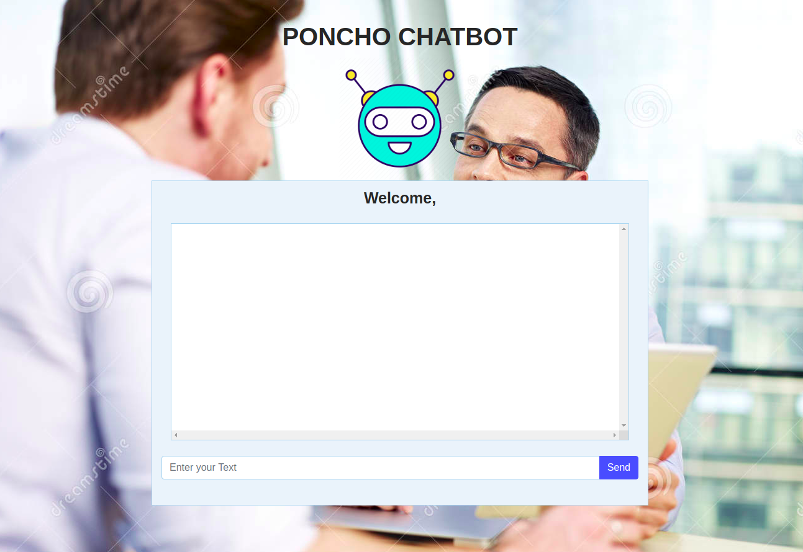
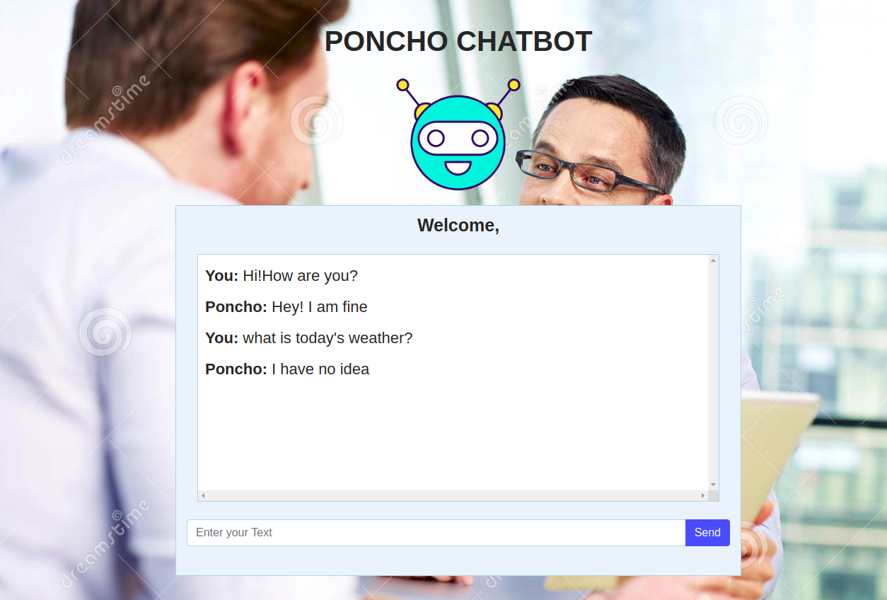

# poncho

## A Deep Learning seq2seq chatbot.

Initial steps
---------------
You will first need to fullfill some dependencies. So, run ```python -r requirements.txt``` in ```poncho``` and in ```nmt_chatbot```. We recommend using ```vitualenv``` or similar environments to make things a bit easy to manage.

Steps to clean and prepare the data
------------------------------------
This repo comes with multiple files to clean and prepare your input data. But fear not, we have a clean CLI to help you perform the cleanup steps that you require. We have used Reddit comment dumps from [files.pushshift.io](https://files.pushshift.io). So any data that is similarly structured will work.

For instructions on available options, simply run ```python manage.py -h``` in ```poncho``` directory.

Steps to train the chatbot
---------------------------
1.  Place your input text in ```nmt_chatbot/new_data``` and name the file as ```train.from```
2.  Then place the expected output in ```nmt-chatbot/new_data``` and name it as ```train.to```
3.  You can leave the provided test data as it is.
4.  Navigate to ```nmt_chatbot/settings.py``` and modify the settings as per your wish. The settings provided by default should be able to get a very basic chatbot running. We would recommend increasing the vocabulary size before modifying any other setting. Documentation for ```nmt_chatbot``` can be found [here](https://www.github.com/waduhek/nmt-chatbot).
5.  Next step is to prepare the input data. Navigate to ```nmt_chatbot/setup``` and run ```prepare_data.py```. This generates the vocabulary based on the settings provided.
6.  Now, to train the chatbot. Go to ```nmt_chatbot``` and run ```train.py```.
7.  Boom! You now have a chatbot that's ready to roll.

Seeing the chatbot in action
-----------------------------
1.  To run the chatbot, navigate to ```gui``` and run ```fileuploader.py``` and ```server.py``` in two separate terminals/command prompts
2.  Now open up any browser of your choice and type in ```localhost:8888```. Now you can interact with the chatbot!

----------------------------------------------------------------------------------------------------------------------

Example screenshots
--------------------




